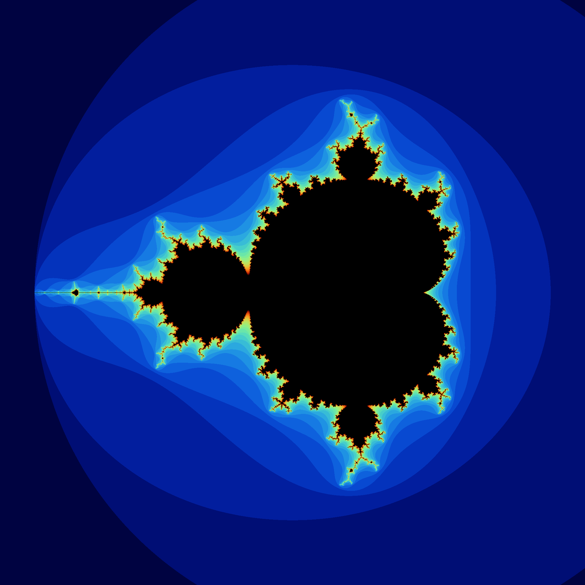

# madelbrot

A simple example showing how to calcluate a [Madelbrot](https://en.wikipedia.org/wiki/Mandelbrot_set) fractal using the `dp::thread_pool` class. This example builds as a command line executable. After building run the following command to see the available options.

```bash
./mandelbrot -h
```

Example output:


